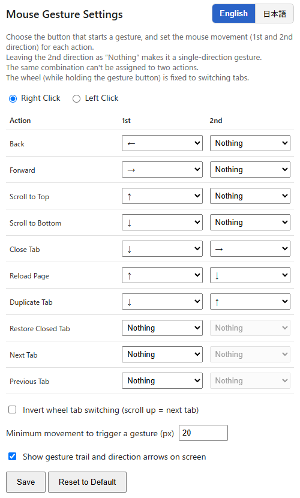
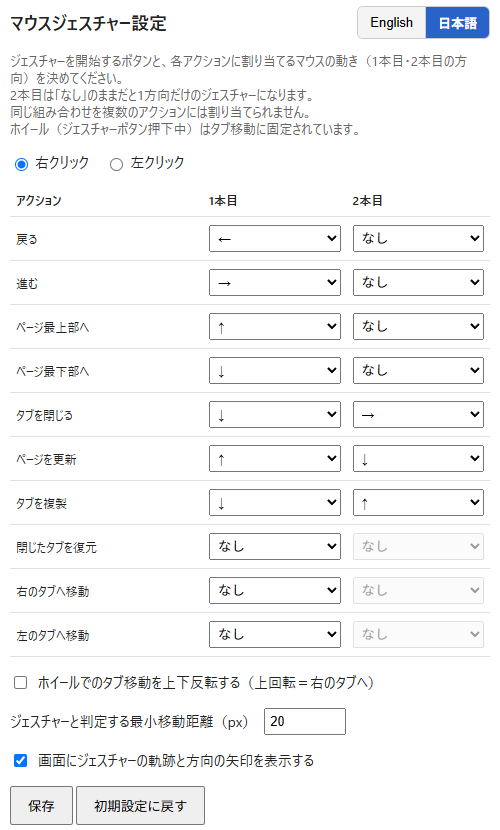

<table>
  <tr>
    <td width="50%" align="center">
      <strong>English</strong>
    </td>
    <td width="50%" align="center">
      <strong>日本語</strong>
    </td>
  </tr>
  <tr>
    <td valign="top">
      Customizable mouse gestures for tabs & navigation: close, reload, duplicate, switch tabs, go back/forward, and more.
        
      
    </td>
    <td valign="top">
      右クリック＋マウスの動きで、戻る・進む・タブを閉じる・複製・切替などを実行。すべて自分好みに割り当て変更できます。
        
      
    </td>
  </tr>
</table>
